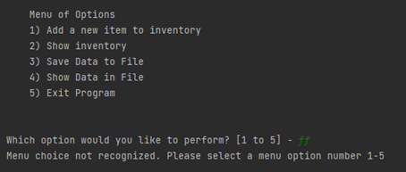
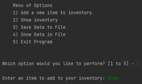
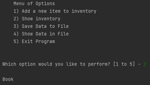
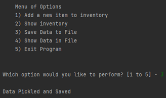
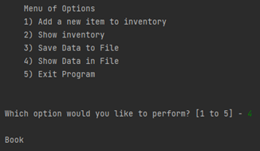
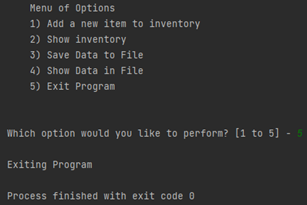
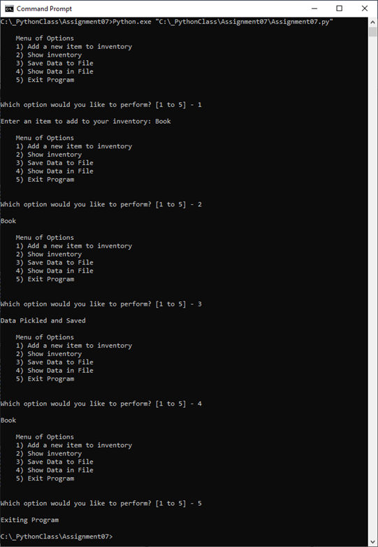
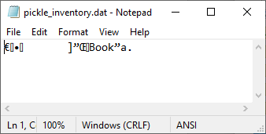

# Assignment 07: Pickling & Error Handling
**Dev:** *STupponce*  
**Date:** *05/24/2021*  

## Introduction
The goal for this assignment was create an example for how pickling in Python works and how to perform custom error handling. This assignment differed from other assignments in that it was not as structured. Research on these topics had to be done independently, and the script had to show original example of pickling and error handling based on the independent research. The script created was a simple program that allowed the user to enter items into an inventory, view the items in the inventory, pickle and save the data to a file, un-pickle and read the file data, and then exit the program. Some functions from previous assignments were slightly modified and recycled, while some functions were new.

## Creating Python Script
### Data Layer
At the very beginning of the script, the “import” command was used to import the pickle-related functions. Within the Data layer, the variables “item”, “inventory” and “inventory_file” were defined. “item” was a string for the item the user wanted to add to the inventory. “inventory” was a list which would be made up of “item”. “inventory_file” was the name of the binary file that the pickled data would be saved to. The code can be seen below in Listing 1: Defined Variables.
```
import pickle

# -- Data -- #
item = ""  # str item to add to inventory
inventory = []  # list data to pickle
inventory_file = "pickle_inventory.dat"  # filename
```
Listing 1: Defined Variables

### Processing Layer
The processing functions were defined in the processing section of the script. The function “pickle_and_write_data” was for opening/creating a file and using “pickle.dump()” to save the data to the file. The file was then closed. The parameters were the data in the form of a list, and the file name that the data was to be saved to. No value was returned. The function code can be seen below in Listing 2: “pickle_and_write_data” Function.
```
def pickle_and_write_data(data, file_name):
    """Creates a binary file and writes pickled data do it

    param: list data
    param: file name to save data to
    """
    file = open(file_name, "ab")  # creates a binary file and opens in append mode
    pickle.dump(data, file)  # pickles and stores the data list in the file
    file.close()
```
Listing 2: “pickle_and_write_data” Function

The function “unpickle_and_read_data” was for reading the pickled data from a file and unpickling it so that it would be readable. The file designated in the parameter was opened in read binary mode. The data was then extracted using the “pickle.load()” command and the data was returned. The function code can be seen below in Listing 3: “unpickle_and_read_data” Function.
```
def unpickle_and_read_data(file_name):
    """Reads data from file and un-pickles it

    param: file name to get data from
    return: str list (un-pickled data from file)
    """
    file = open(file_name, "rb")
    data = pickle.load(file)
    return data
```
Listing 3: “unpickle_and_read_data” Function

### Input/Output Layer
In the Input/Output section contained the functions that displayed info to the user or captured user inputs. The functions in this layer were functions that had been used in previous assignments that were slightly modified to fit the needs of this assignment. The “print_menu” function displayed a menu of modified choices to the user. The code can be seen below in Listing 4: “print_menu” Function.
```
def print_menu():
    """  Displays a menu of choices to the user"""

    print('''
    Menu of Options
    1) Add a new item to inventory
    2) Show inventory
    3) Save Data to File 
    4) Show Data in File       
    5) Exit Program
    ''')
    print()
```
Listing 4: “print_menu” Function

The function “menu_choice”  was also a previously existing function that captured the user input for what menu option they wanted to choose. However, this function was modified so that the input was saved as an integer instead of a string. This was done to be able to show an example of error handling. A “try” and “except” block was used within this function so that if the user input a menu choice other than a number, a ValueError exception would pop up with a custom error statement. The code can be seen below in Listing 5: “menu_choice” Function.
```
def menu_choice():
    """ Gets the menu choice from a user

    :return: int
    """
    try:
        choice = int(input("Which option would you like to perform? [1 to 5] - "))
        print()
        return choice
    except ValueError:  # gives an error if the user does not enter a menu number choice
        print("Menu choice not recognized. Please select a menu option number 1-5")
```
Listing 5: “menu_choice” Function

The result of the user entering a value other than a number as their menu choice can be seen in Figure 1: ValueError.  
  
Figure 1: ValueError

### Main Body of Script
The main body of the script of where the functions that were created in the other sections were called based on the menu choice made by the user. The if statements connected to each menu choice were nested inside a while loop so that the menu choice would continue to show up until the user made the selection to exit the program. The code can be seen below in Listing 6: Main Body.
```
while True:
    print_menu()
    user_choice = menu_choice()

    if user_choice == 1:  # add a new item to inventory
        item = str(input("Enter an item to add to your inventory: "))
        inventory.append(item)
    elif user_choice == 2:  # show inventory
        for item in inventory:
            print(item)
    elif user_choice == 3:  # save data to file
        pickle_and_write_data(inventory, inventory_file)  # pickles and saves data to file
        print("Data Pickled and Saved")
    elif user_choice == 4:  # show data in file
        unpickle_and_read_data(inventory_file)
        for item in inventory:
            print(item)
    elif user_choice == 5:  # exit program
        print("Exiting Program")
        break
```
Listing 6: Main Body

The fist menu choice was to allow the user to add a new item to the inventory. No functions were used in this section since the needed code was relatively simple. The results of running this section in PyCharm can be seen below in Figure 2: PyCharm – Choice 1.  
  
Figure 2: PyCharm – Choice 1

The second menu choice was to show the items that were currently saved in the inventory. The item that was added, “Book”, can be seen now in the inventory. The results of running this section in PyCharm can be seen below in Figure 3: PyCharm – Choice 2.  
  
Figure 3: PyCharm – Choice 2

The third menu choice was to allow the user to pickle the inventory data and save it to a binary file. It used the function “pickle_and_write_data” perform the necessary commands previously described. The results of running this section in PyCharm can be seen below in Figure 4: PyCharm – Choice 3.  
  
Figure 4: PyCharm – Choice 3

The fourth menu choice was to allow the un-pickle and show the data that was saved to the file. It used the functions “unpickle_and_read_data” to load the data from the file and un-pickle it so that the data could be seen and read by the user. The results of running this section in PyCharm can be seen below in Figure 5: PyCharm – Choice 4.  
  
Figure 5: PyCharm – Choice 4

The fifth and last menu choice was to allow the user to exit the program. No functions were required for this section, only a “break” command. The results of running this section in PyCharm can be seen below in Figure 6: PyCharm – Choice 5.  
  
Figure 6: PyCharm – Choice 5

### Test
Since it had been verified that the script worked when running it in PyCharm, a test was performed to verify that it also worked in the Command Window. Figure 7: Command Window Running Script show the script being tested with the Command Window.  
  
Figure 7: Command Window

The resulting pickled file can also be seen in Figure 8 Pickled File.  
  
Figure 8 Pickled File

## Summary
While this assignment differed from others in that it required independent research for some of the topics, many of the concepts used were already known from previous assignments, such as loops and functions. The advantage to pickling can be seen in that it allows the user to save their data in a form that may not be easily readable when opened. The advantage to custom error handling can also be a seen in that it allows the developer to write an error message that may explain the error more clearly to the user and suggest a way to fix the error.
